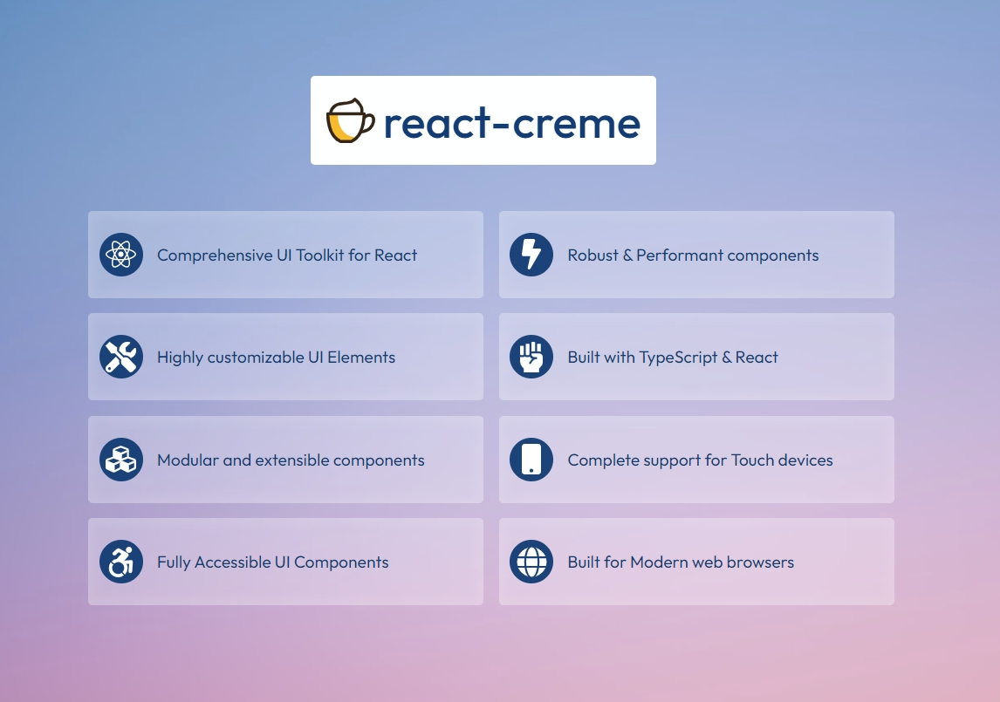

[](https://github.com/prabhuignoto/react-creme/actions/workflows/linter.yml)
[](https://codecov.io/gh/prabhuignoto/react-creme)
[](https://snyk.io/test/github/prabhuignoto/react-creme)
[](https://sonarcloud.io/summary/new_code?id=react-creme)
[](https://www.codefactor.io/repository/github/prabhuignoto/react-creme)
[](https://img.shields.io/badge/status-alpha-green)

<section>
  
</section>

</br>

# react-creme

Modern UI Toolkit for React

> This is a Monorepo powered by Turbo Repo. Both the library and the documentation is housed in the mono repo

## Getting Started

Install the package using npm or yarn

```sh
yarn add react-creme

or

npm install react-creme

```

## Usage

```sh
  import React from "react";
  import { Button } from "react-creme";

  const App = () => {
    return (
      <div>
        <Button>Click Me</Button>
      </div>
    );
  };

  export default App;
```

## Browser Support

`react-creme` is a modern UI component library with support for all the latest browsers

<div style="display: flex; justify-content: space-between; width: 280px">
  
  
  
  
</div>

## Development

```sh
pnpm install
pnpm dev
```

## Build

To build everything

```sh
pnpm build
```

To build the library

```sh
pnpm build: lib
```

To build and run the documentation

```sh
pnpm build:doc
cd ./documentation/expo_dist && npx serve .
```

To run the Unit tests

```sh
pnpm test
```

[](https://sonarcloud.io/summary/new_code?id=react-creme)
